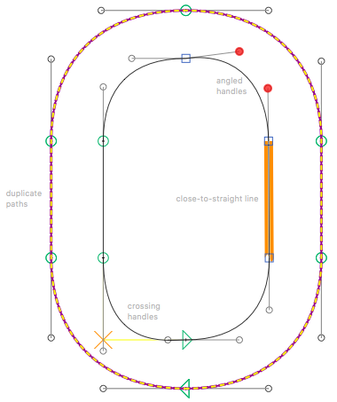

# ShowAngledHandles.glyphsReporter

This is a plugin for the [Glyphs font editor](https://glyphsapp.com/) by Georg Seifert.
It highlights BCPs (‘handles’) which are not horizontal or vertical, quite-but-not-completely-straight line segments, duplicate paths, crossed handles, and zero handles.
After installation, it will add the menu item *View > Show Angled Handles* (Cmd-Y, German: *Ansicht > Schräge Anfasser anzeigen*).



### Installation

1. Download the complete ZIP file and unpack it, or clone the repository.
2. Double click the .glyphsReporter file. Confirm the dialog that appears in Glyphs.
3. Restart Glyphs

### Usage Instructions

1. Open a glyph in Edit View.
2. Use *View > Show Angled Handles* (Cmd-Y) to toggle the highlighting of of handles which are not completely straight.

### Options

Access display options in the context menu (Ctrl- or right-click):


You can set a different keyboard shortcut (i.e., other than Cmd-Y) by typing this in the Macro window (*Window > Macro Panel*) and pressing the *Run* button:

```python
Glyphs.defaults["com.mekkablue.ShowAngledHandles.keyboardShortcut"] = "l"
```

In this example, the shortcut is changed to Cmd-L. Instead of `l`, you can take any other key on your keyboard, of course. Restart Glyphs for the changes to take effect. 

### Requirements

The plugin requires app version 2.3 (837) or later, running on OS X 10.9.1 or later. For older versions of Glyphs, use the `_old` file enclosed in the repository.

### License

Copyright 2013 Rainer Erich Scheichelbauer (@mekkablue).
Including sample code by Georg Seifert (@schriftgestalt) and Jan Gerner (@yanone).

Licensed under the Apache License, Version 2.0 (the "License");
you may not use this file except in compliance with the License.
You may obtain a copy of the License at

http://www.apache.org/licenses/LICENSE-2.0

See the License file included in this repository for further details.
