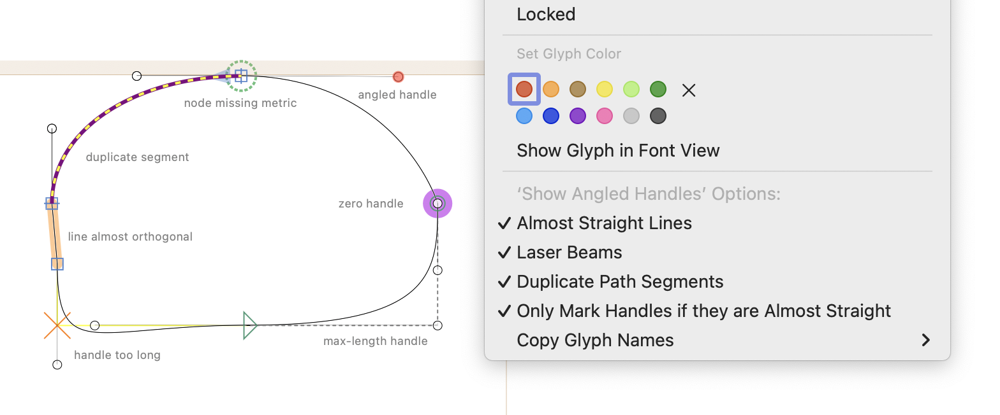

# ShowAngledHandles.glyphsReporter

This is a plugin for the [Glyphs font editor](https://glyphsapp.com/). It highlights BCPs (‘handles’) which are not horizontal or vertical, quite-but-not-completely-straight line segments, duplicate path segments, crossed handles (i.e., BCPs with more than 100% length), nodes missing metrics by a unit, and zero handles.
After installation, it will add the menu item *View > Show Angled Handles* (Ctrl-Y, de: *Schräge Anfasser anzeigen,* es: *Mostrar manejadores inclinados,* fr: *Afficher les poignées inclinées,* it: *Mostra maniglie inclinate*, zh: ⚖️路径检查工具).



### Installation

1. Open *Window > Plugin Manager*
2. Click the *Install* button next to ’Show Angled Handles’
3. Restart Glyphs.app

### Usage Instructions

1. Open a glyph in Edit View.
2. Use *View > Show Angled Handles* (Ctrl-Y) to toggle the highlighting.

### Options

Access display options in the context menu (Ctrl- or right-click). You can set a different keyboard shortcut (i.e., other than Ctrl-Y) by typing this in the Macro window (*Window > Macro Panel*) and pressing the *Run* button:

```python
Glyphs.defaults["com.mekkablue.ShowAngledHandles.keyboardShortcut"] = "l"
```

In this example, the shortcut is changed to Ctrl-L. Instead of `l`, you can take any other key on your keyboard, of course. Restart Glyphs for the changes to take effect. 

### Requirements

The plugin requires a recent app version, running on OS X 10.11 or later. If it does not work for you, please update your app and/or macOS to a newer version.

### License

Copyright 2013 Rainer Erich Scheichelbauer (@mekkablue).
ObjC update copyright 2019 by Georg Seifert (@schriftgestalt).

Based on sample code by Georg Seifert (@schriftgestalt).

Licensed under the Apache License, Version 2.0 (the "License");
you may not use this file except in compliance with the License.
You may obtain a copy of the License at

http://www.apache.org/licenses/LICENSE-2.0

See the License file included in this repository for further details.
